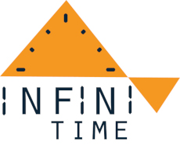

## InfiniTime 中文支援
PineTime 現在也可以顯示中文了！  
這個 InfiniTime 版本增加了 2500 個精選常用正體中文字，注音符號與日文假名，以提供台灣使用者最佳的顯示體驗。  
安裝了本版本後將可顯示約 98% 日常用語。而超過 2500 字的部份，則可搭配 https://github.com/Boteium/GadgetBridge 來做相似字替換，或注音替換 (也就是會有 2% 的錯別字或注音文)  

因為中文字必須佔用很大的儲存空間，本版本移除了下列功能
- 天氣 (還沒有錶面支援顯示)  
- 導航 (GadgetBridge 不支援)  
- 加速感應器 (僅移除 app. 仍可透過藍芽讀取)  
- Two (類似 2048 的遊戲)  
- 錶面: Casio, InfiniTime, PineTime, Terminal (這幾個很佔空間)  

## Infinitime Traditional Chinese fork
This forks adds about 2500 Traditional Chinese characters, bopomofo, and Japanese kana for Taiwanese user.  
Due to the space limit. The following apps are **removed**.  
- Weather (not yet integrated with watchface)  
- Navigation (no GadgetBridge support)  
- Motion (only remove app. bluetooth backgroud service is still preserved)  
- Two (games)  
- WatchFace: Casio, InfiniTime, PineTime, Terminal (because they takes a lots of space)  

# [InfiniTime](https://github.com/InfiniTimeOrg/InfiniTime)

Fast open-source firmware for the [PineTime smartwatch](https://www.pine64.org/pinetime/) with many features, written in modern C++.

## New to InfiniTime?

- [Getting started with InfiniTime](doc/gettingStarted/gettingStarted-1.0.md)
- [Updating the software](doc/gettingStarted/updating-software.md)
- [About the firmware and bootloader](doc/gettingStarted/about-software.md)

### Companion apps

- [Gadgetbridge](https://gadgetbridge.org/) (Android)
- [AmazFish](https://openrepos.net/content/piggz/amazfish/) (SailfishOS)
- [Siglo](https://github.com/alexr4535/siglo) (Linux)
- [InfiniLink](https://github.com/InfiniTimeOrg/InfiniLink) (iOS) **[Looking for a new maintainer]**
- [ITD](https://gitea.arsenm.dev/Arsen6331/itd) (Linux)

***Note** : We removed mentions to NRFConnect as this app is closed source and recent versions do not work anymore with InfiniTime (the last version known to work is 4.24.3). If you used NRFConnect in the past, we recommend you switch to [Gadgetbridge](https://gadgetbridge.org/).*

## Development

- [InfiniTime Vision](doc/InfiniTimeVision.md)
- [Rough structure of the code](doc/code/Intro.md)
- [How to implement an application](doc/code/Apps.md)
- [Generate the fonts and symbols](src/displayapp/fonts/README.md)
- [Tips on designing an app UI](doc/ui_guidelines.md)
- [Bootloader, OTA and DFU](bootloader/README.md)
- [External resources](doc/ExternalResources.md)
- [Versioning](doc/versioning.md)
- [Project branches](doc/branches.md)
- [Files included in the release notes](doc/filesInReleaseNotes.md)

### Contributing

- [How to contribute?](doc/contribute.md)
- [Coding conventions](doc/coding-convention.md)

### Build, flash and debug

- [InfiniTime simulator](https://github.com/InfiniTimeOrg/InfiniSim)
- [Build the project](doc/buildAndProgram.md)
- [Build the project with Docker](doc/buildWithDocker.md)
- [Build the project with VSCode](doc/buildWithVScode.md)
- [Flash the firmware using OpenOCD and STLinkV2](doc/openOCD.md)
- [Flash the firmware using SWD interface](doc/SWD.md)
- [Flash the firmware using JLink](doc/jlink.md)
- [Flash the firmware using GDB](doc/gdb.md)
- [Stub using NRF52-DK](doc/PinetimeStubWithNrf52DK.md)

### API

- [BLE implementation and API](doc/ble.md)

### Architecture and technical topics

- [Memory analysis](doc/MemoryAnalysis.md)

## Licenses

This project is released under the GNU General Public License version 3 or, at your option, any later version.

It integrates the following projects:

- RTOS : **[FreeRTOS](https://freertos.org)** under the MIT license
- UI : **[LittleVGL/LVGL](https://lvgl.io/)** under the MIT license
- BLE stack : **[NimBLE](https://github.com/apache/mynewt-nimble)** under the Apache 2.0 license
- Font : **[Jetbrains Mono](https://www.jetbrains.com/fr-fr/lp/mono/)** under the Apache 2.0 license

## Credits

I’m not working alone on this project. First, many people create PR for this projects. Then, there is the whole #pinetime community : a lot of people all around the world who are hacking, searching, experimenting and programming the Pinetime. We exchange our ideas, experiments and code in the chat rooms and forums.

Here are some people I would like to highlight:

- [Atc1441](https://github.com/atc1441/) : He works on an Arduino based firmware for the Pinetime and many other smartwatches based on similar hardware. He was of great help when I was implementing support for the BMA421 motion sensor and I²C driver.
- [Koen](https://github.com/bosmoment) : He’s working on a firmware based on RiotOS. He integrated similar libs as me : NimBLE, LittleVGL,… His help was invaluable too!
- [Lup Yuen Lee](https://github.com/lupyuen) : He is everywhere: he works on a Rust firmware, builds a MCUBoot based bootloader for the Pinetime, designs a Flutter based companion app for smartphones and writes a lot of articles about the Pinetime!
